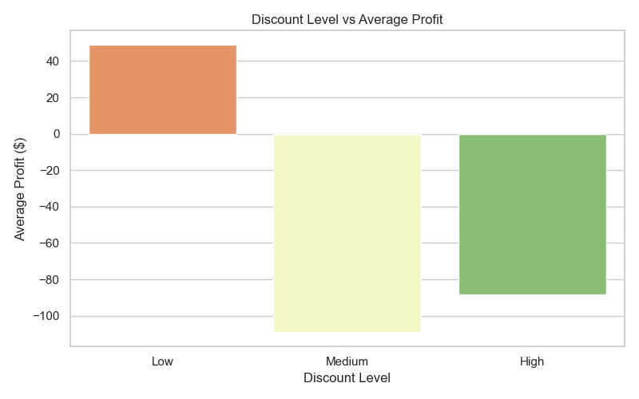
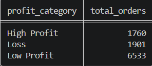

# 📊 SQL Sales Analysis

## 🔍 Overview
This project analyzes retail sales data using SQL to uncover key business insights related to revenue, profitability, and discount strategies.

The objective is to identify factors impacting profit and provide actionable recommendations to improve overall business performance.

---

## 🛠 Tech Stack
- SQL (SQLite)  
- VS Code  
- CSV Dataset  
---

## ▶️ How to Run

### Prerequisites
- Python 3.8+
- SQLite (built into Python)

### 1. Clone the repository
```bash
git clone https://github.com/divyajyoti496-svg/SQL-Sales-Analysis.git
cd SQL-Sales-Analysis
```

### 2. Install dependencies
```bash
pip install pandas matplotlib seaborn
```

### 3. Generate the charts
```bash
python analysis.py
```
Charts will be saved to the `assets/` folder.

### 4. Run the SQL queries
Open `queries/analysis.sql` in any SQLite-compatible tool (e.g., DB Browser for SQLite, or VS Code with the SQLite extension) and run against `superstore.db` — or recreate the DB by loading `data/samplesuperstore.csv`.

---

## 📁 Project Structure

SQL-Sales-Analysis/
│
├── data/
│ └── samplesuperstore.csv
├── queries/
│ └── analysis.sql
├── insights.md
├── superstore.db
└── README.md

---

## 📸 Sample Outputs

## 📊 Discount vs Profit



## 📊 Profit Categories



---

## 📊 Key Metrics
- Profit Margin: ~12–13%  
- Loss Transactions: ~18–19%  

---

## 📊 Key Analysis Areas
- Revenue & Profit Analysis  
- Profitability Segmentation  
- Discount Impact Evaluation  
- Loss-making Transaction Analysis  

---

## 📈 Key Insights
- Profitability is highly sensitive to discount levels  
- Revenue generation does not guarantee profitability  
- A large portion of orders contributes minimal or negative value  
- High discount levels consistently lead to losses  

---

## 📊 Visual Analysis

### Discount vs Average Profit

High discount levels consistently result in negative average profit, reinforcing the need for controlled pricing strategies.
---

## 📈 Business Impact
Reducing high discount transactions could improve overall profitability by an estimated 15–25%, based on observed loss patterns.

---

## ⚠️ Business Problem Identified
Despite strong revenue generation, the business suffers from **margin inefficiencies** due to aggressive discounting strategies.

---

## 💡 Recommendations
- Restrict high discount ranges to prevent loss-making transactions  
- Implement profit-based pricing strategies  
- Focus on high-margin sales segments  
- Monitor and reduce loss-making orders  

---

## 📌 Conclusion
The analysis highlights that optimizing pricing and discount strategies can significantly improve profitability while maintaining sustainable revenue growth.

---

## 🚀 Future Work
- Build interactive dashboard (Power BI / Looker Studio)  
- Perform category-level profitability analysis  
- Implement predictive modeling for discount optimization

---

## 📎 Detailed Insights
For complete analysis and interpretation:
👉 Refer to `insights.md`

---

## 👤 Author
**Divyajyoti Tripathy**  
- Aspiring Data Analyst | SQL | Data Analysis | AI Automation  
- LinkedIn: https://www.linkedin.com/in/divyajyoti-tripathy-57baa2295  

---

## ⭐ Acknowledgement
This project is part of a hands-on learning journey in SQL-based data analysis and business insight generation.
